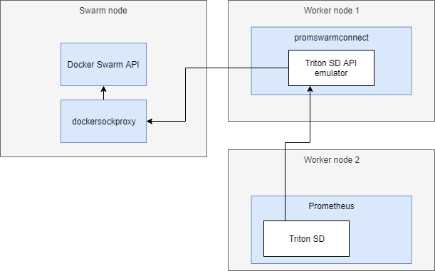

What?
-----

Syncs services/tasks from Docker Swarm to Prometheus by pretending to be a Triton service
discovery endpoint, which is a
[built-in service discovery module](https://github.com/prometheus/prometheus/tree/master/discovery/triton)
in Prometheus.

Features:

- Have your container metrics scraped fully automatically to Prometheus.
- We don't have to make ANY changes to Prometheus (or its container) to support Docker
  Swarm (except configuration changes).
- Supports overriding metrics endpoint (default `/metrics`) and port.
- Supports clustering, so containers are discovered from all nodes. Neither Prometheus
  nor promswarmconnect needs to run on the Swarm manager node.
- Supports scoping Prometheus `job` label to a) container (default), b) host (think host-level
  metrics) or c) static string (think cluster-wide metrics).
  [Read more](https://github.com/function61/promswarmconnect/blob/1eb89b3c0219f374aa116e6068ca02ac13b13f30/promswarmconnect/main.go#L189)

How to use
----------

Configure your Prometheus:
[example configuration that works for us](https://github.com/function61/prometheus-conf/blob/master/prometheus.yml).

The `endpoint` needs to be your service name in Docker that you use to run promswarmconnect.
Prometheus and promswarmconnect need to be in the same Docker network.

Docker's socket needs to be exposed over HTTPS with a client cert authentication. We use
[dockersockproxy](https://github.com/function61/dockersockproxy) for this. You can do the
same with just pure Docker (expose the API over HTTPS) configuration, but I found it much
easier to not mess with default Docker settings, but to do this by just running a container.

Below configuration `CLIENTCERT` (and its key) refers to the client cert that is allowed to
connect to the Docker socket over HTTPS.

You need to define these ENV variables when running promswarmconnect:

- `DOCKER_URL` - URL to Docker API (e.g. `https://dockersockproxy:4431`)
- `NETWORK_NAME` - name of the overlay network from which to scrape containers to Prometheus
- `CLIENTCERT` - client cert in base64 format (`$ cat cert.pem | base64 -w 0`)
- `CLIENTCERT_KEY` - client cert's key in base64 format (`$ cat cert.key | base64 -w 0`)

Alternatives & links
--------------------

- https://github.com/ContainerSolutions/prometheus-swarm-discovery
- https://github.com/prometheus/prometheus/issues/1766
- https://github.com/jmendiara/prometheus-swarm-discovery
